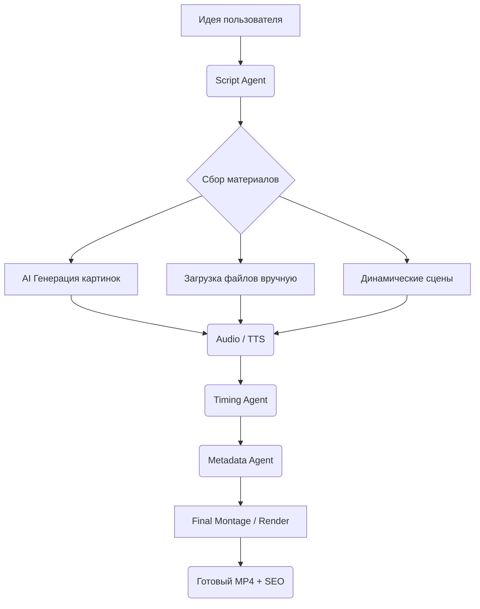

# 🏗 AI Video Factory Architecture (v12.5)

Этот документ описывает внутреннее устройство системы, взаимодействие ИИ-агентов и логику работы видео-движка.

---

## 1. Концепция "Единого Источника Истины" (project.json)
В основе каждого видео лежит файл `project.json`. Все агенты работают асинхронно, но результат их деятельности всегда записывается в этот файл. Это позволяет:
*   **Восстанавливать процесс** с любого этапа при сбое.
*   **Перерендеривать проект** с новыми настройками без повторной генерации сценария или озвучки.
*   **Проводить аудит**: Легко понять, на каком этапе возникла ошибка (некорректный тайминг, битый ассет и т.д.).

---

## 2. Иерархия ИИ-Агентов

### 🧠 Агент Сценариев (Script Agent)
*   **Вход**: Промпт пользователя + пресет канала.
*   **Выход**: JSON-структура со сценами, визуальными описаниями и текстом для озвучки.
*   **Логика**: Использует DeepSeek-V3 для создания структуры "Крючок (Hook) -> Контекст -> Кульминация -> Призыв".

### ⏱ Агент Синхронизации (Timing Agent)
*   **Вход**: Аудиофайл (озвучка).
*   **Выход**: Пословные таймкоды (Word-level timestamps).
*   **Технология**: OpenAI Whisper. Агент не просто распознает текст, но и высчитывает точную длительность каждой сцены, чтобы видеоряд идеально попадал в ритм речи.

### 🎭 Агент Динамических Сцен (Graphics Agent)
*   **Вход**: Ассеты пользователя (лого, фото, фон) + шаблоны из `dynamic_scenes.json`.
*   **Выход**: Предварительно отрендеренные видео-вставки (.mp4).
*   **Роль**: Позволяет "на лету" создавать сложную графику (плавающие логотипы, сравнения, ценники) и вставлять их в основной монтаж как обычные клипы.

### 📝 SEO Агент (Metadata Agent)
*   **Вход**: Итоговый сценарий + инструкции по стилю (Viral, Edu, Shorts).
*   **Выход**: JSON SEO-пакет (Заголовок, Описание, Теги, Слаг).
*   **Роль**: Подготовка видео к публикации на конкретных платформах (YouTube/TikTok).

---

## 3. Видео-движок: Гибридный Подход

Система использует два мощных инструмента для достижения максимального качества и скорости:

1.  **FFmpeg (Engine Room)**:
    *   Используется для финальной сборки проекта.
    *   Обеспечивает аппаратное ускорение и быструю склейку потоков.
    *   Отвечает за наложение фоновой музыки и субтитров.

2.  **MoviePy (Creative Studio)**:
    *   Используется для пре-рендеринга сложных сцен.
    *   Позволяет работать с Python-кодом для создания анимаций (пульсация, зум, затухание).
    *   Идеален для динамического наложения текста поверх видео.

---

## 4. Жизненный Цикл Проекта (Pipeline)

---

## 5. Расширяемость (Presets System)
Архитектура позволяет масштабировать проект без изменения ядра:
*   `config/audio_presets.json`: Добавление новых голосов и движков (Edge, ElevenLabs).
*   `config/dynamic_scenes.json`: Описание новых графических шаблонов.
*   `config/channel_context.json`: Настройка "личности" вашего канала для СЕО-агента.

---
*Документация поддерживается в актуальном состоянии командой разработки AI Video Factory.*
