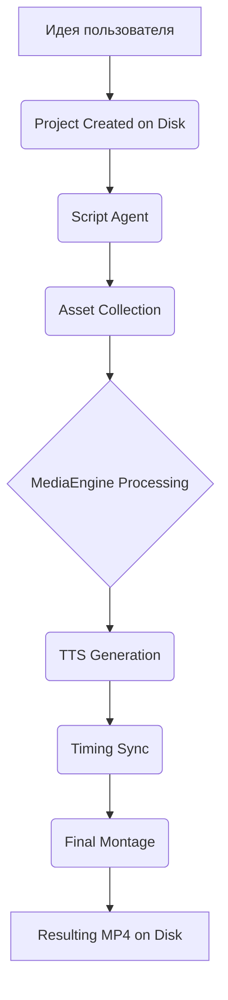

# 🏗 AI Video Factory Architecture (v15.0) - Persistence & Safety Edition

Этот документ описывает внутреннее устройство системы, взаимодействие ИИ-агентов и логику работы видео-движка после глобального рефакторинга (Sprint 1-3).

---

## 1. Концепция "Disk-First" (Единый Источник Истины)
В версии 15.0 мы полностью отказались от хранения критических данных в оперативной памяти (FSM). 
*   **project.json**: Является единственным источником правды. Все хендлеры и агенты читают данные только из этого файла.
*   **Авто-восстановление**: При команде `/start` бот проверяет папку `projects/` и предлагает пользователю продолжить последний незавершенный проект.
*   **Устойчивость**: Перезагрузка сервера или сброс FSM-стейта больше не приводят к потере прогресса.

---

## 2. Иерархия и Модульность

### 🎨 MediaEngine (Core Layer)
Центральный узел обработки медиа (`core/media_engine.py`).
*   **Унификация**: Все агенты (Montage, Dynamic) используют этот движок для ресайза, блюра и наложения эффектов.
*   **Эстетика**: Единый стандарт "Premium Blur" (resize 0.05 + upscale 20.0) и Ken Burns эффектов.
*   **Безопасность**: Автоматическая подрезка, замедление видео под длительность сцены и обработка битых файлов.

### 🎭 AI Агенты
1.  **Script Agent**: Генерирует структуру проекта в `project.json`.
2.  **Timing Agent (Whisper)**: Прописывает точные таймкоды начала и конца сцен в `project.json`.
3.  **Montage Agent**: Выполняет финальную сборку, используя `MediaEngine`.
4.  **Graphics Agent**: Рендерит динамические вставки, также опираясь на `MediaEngine`.

---

## 3. Видео-движок: MoviePy + MediaEngine

Система оптимизирована для работы с MoviePy v2.0+:
*   **CompositeVideoClip**: Используется как основной контейнер для всех слоев (Background, Foreground, Overlay).
*   **Стабильный Ресайз**: Реализован через `MediaEngine.smart_resize_stable`, исключающий черные полосы и искажения пропорций.
*   **Аппаратное ускорение**: При рендеринге используются многопоточность (`threads=4`) и пресет `veryfast` для баланса скорости и качества.

---

## 4. Пайплайн (Pipeline Manager)

---

## 5. Защита и Отказоустойчивость
*   **ErrorHandlingMiddleware**: Перехватывает любые исключения в боте, уведомляет пользователя и предотвращает зависание интерфейса.
*   **Download Retries**: Автоматические повторные попытки при скачивании тяжелых файлов из Telegram.
*   **Safe Edit**: Механизм безопасного обновления сообщений (текст/caption), исключающий падения при смене типов контента.

---
*Документация актуализирована в рамках глобального обновления стабильности проекта.*
